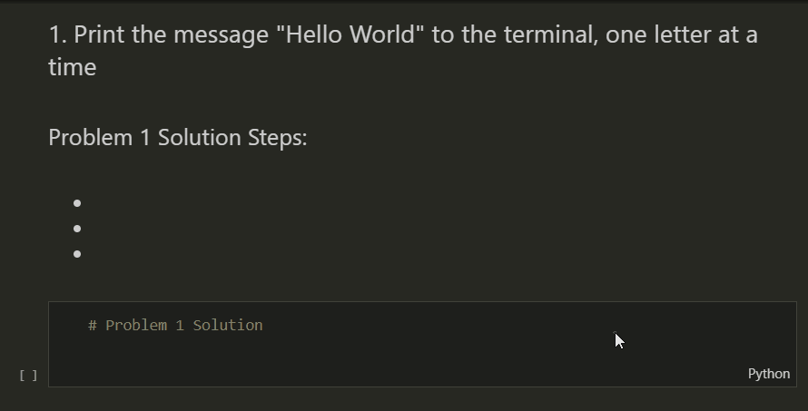
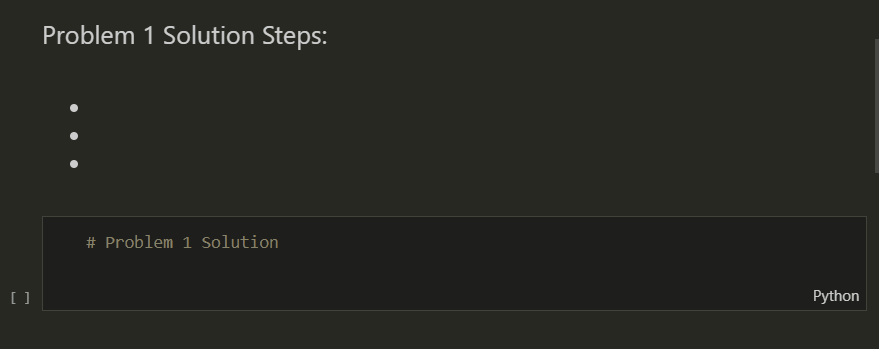

# Data Analytics - Jupyter in Action

## INTRODUCTION

This assignment will give you practice working within a Jupyter Notebook, combining Markdown and Python together in a single file!

Begin with the `Jupyter_In_Action.ipynb` file.

If you finish early, there is a bonus assignment included in the `BONUS_Jupyter_Problem_Solving_Problems.ipynb` file.

---

## INSTRUCTIONS FOR SETUP

1. Download the `.zip` file from this **GitHub** repository
2. Unzip on your computer and open in **Visual Studio Code**
3. Select the `Jupyter_In_Action.ipynb` file to open in your code editor
4. Beneath each problem, there will be a **Markdown Block** and a **Python Code Block**
5. Within the **Markdown Block**, **double click** to open the text editor
    * Describe your steps for solving the current problem
    * Click the :heavy_check_mark: next to the markdown block to display your changes

6. Within the **Python Code Block**, write your solution to the current problem
    * Click the play button to the left of the editor to run your code block
    * Check below the code block to see the output of your code!

7. Starting from the top of the page, begin working through each of the problems
8. Be sure to thoroughly test each code block before continuing to the next question!